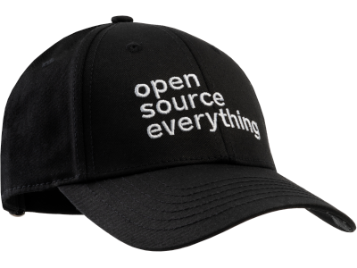
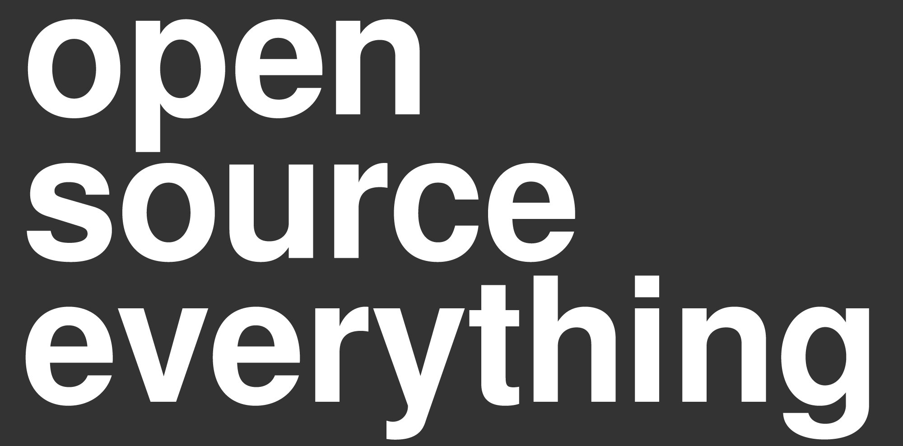
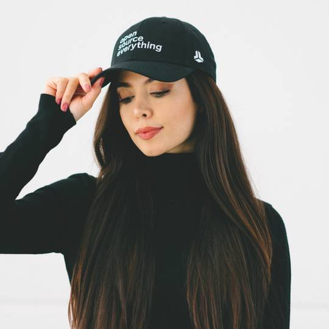
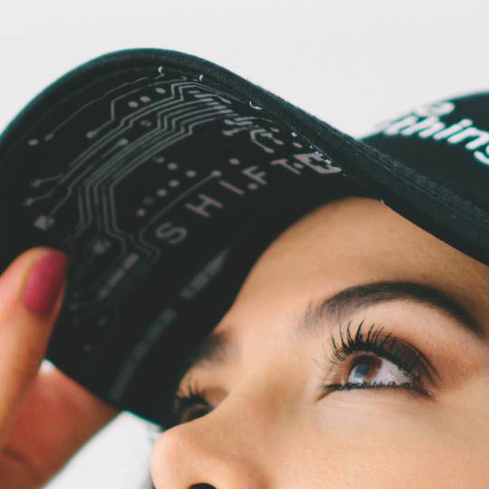

# Open Source Everything

## Our commitment

The BitBox team is committed to open source, believing it's an integral part of the Bitcoin ecosystem. 
The software we use today has evolved through years of collaborative efforts, and we all stand on the shoulders of giants in this journey.

Additionally, only open-source software can be considered fully trustworthy. 
Seeing every part of a transparent machine and verifying its security offers a fundamentally different level of assurance compared to trusting a black box machine, where inputs and outputs are the only verifiable elements. 
We encourage you to trust our code by providing the means for its verification.

Building Bitcoin security products, this is especially relevant.
We believe that closed source code is just not good enough to touch your private keys.

Our range of projects and products is accessible at <https://bitbox.swiss>.

## The baseball cap

As a proud open source company that loves nerdy swag, we designed the original minimalist "open source everything" baseball cap.

The "initial commit" on Twitter was short and sweet: [Open Source Everything #JustThreeWords](https://twitter.com/BitBoxSwiss/status/1583400147819851782).

Since then, this iconic baseball cap has become a runaway sensation, with many "forks" of the design available from different companies and FOSS projects.

## Here it is: Design files available

Observing all the forks, we briefly considered redesigning the cap to "source viewable" and changing the license from true FOSS to a non-commercial license... (kidding!)

We're delighted to see the "open source everything" claim on so many different baseball caps. 
Although we never officially published the layout, it's simple enough that it can be "reverse engineered" with little effort.

In keeping with our claim, we want to provide the design files for all your open-source needs. 
Unfortunately, the font used in the original design is subject to a commercial license that is very restricive. 
It does not allow the free sharing of derived artwork, even if the font itself is not distributed.

**Free Open Source to the rescure!** 
We recreated the artwork using the Free Sans Bold typeface that is part [Free Font collection](https://savannah.gnu.org/projects/freefont/) of the GNU project.
This font is released under the GNU General Public License and can be used and shared freely.
We can therefore publish our artwork under our usual free open-source license. 

You are free to use our design in any way, shape, or form.
And there's no rule that says it can only be put on hats! 

- [bitbox-open-source-everything-free.pdf](bitbox-open-source-everything-free.pdf)
- [bitbox-open-source-everything-free.svg](bitbox-open-source-everything-free.svg)
- [bitbox-open-source-everything-free.png](bitbox-open-source-everything-free.png)

We'd love you to share your designs in an issue in this repository, or tag [@BitBoxSwiss](https://twitter.com/BitBoxSwiss) on Twitter or [Instagram](https://www.instagram.com/bitboxswiss/) if you post about them!

## Get it physically

The original BitBox "open source everything" baseball cap (we call it the "Upstream Edition") contains some additional features, like the BitBox02 PCB print (which is [freely available](https://github.com/digitalbitbox/bitbox02-firmware/blob/master/doc/bb02_v2.10_schematics.pdf) as well, btw) under the brim, and a few more easter eggs.

  
   

If you're interested in acquiring the original BitBox cap, you can find it in our [bitbox.shop](https://bitbox.shop).
